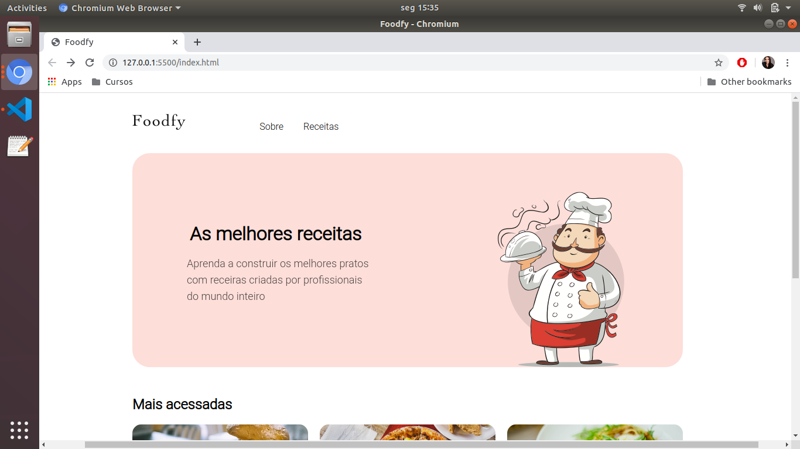
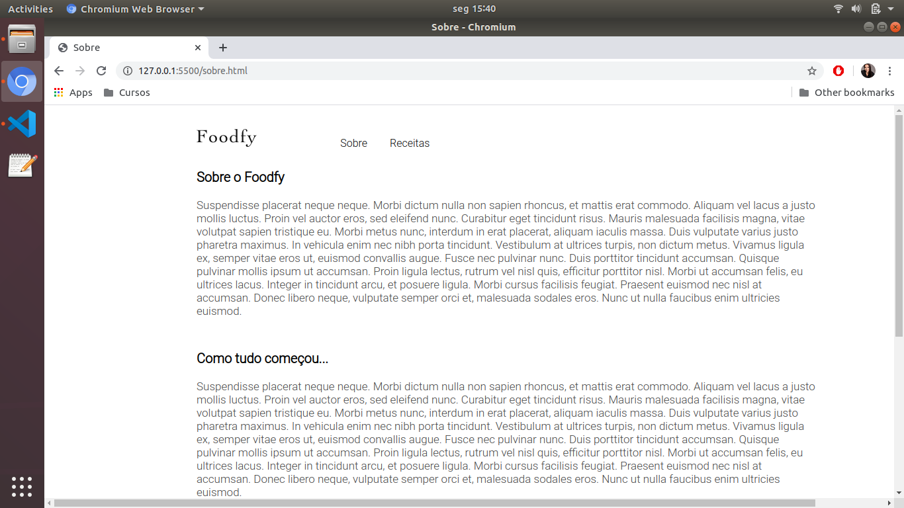
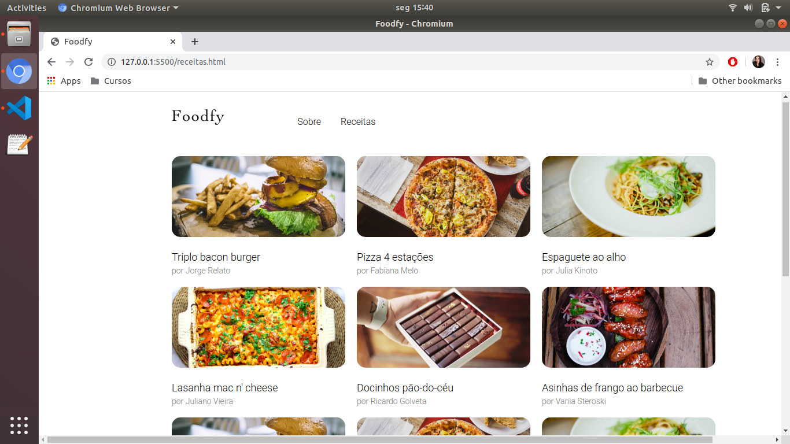
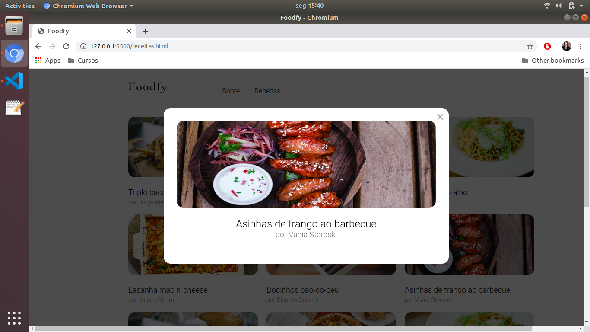

# Foodfy - versão 01

## Descrição
Desafio em frontend, proposto pelo programa Launchbase da Rocketseat, desenvolvido utilizando HTML 5, CSS 3 e JavaScript. 

## Índice
- [Requisitos](#Requisitos)
- [Instalação](#Instalação)
- [Uso](#Uso)

## Requisitos
Não é obrigatório, mas para facilitar o uso, abri as paginas utilizando a extensão Live Server do VS Code. 

## Instalação
- No VS Code, na barra lateral esquerda, clicar em Extensions;
- Digitar Live Server;
- Baixar e deixar a mesma habiltada;

## Uso
Para rodar a aplicação:
- Abrir o arquivo index.html
- Com as teclas ctrl+shift+p , digitar Live Server: Open with live server
- Apertar a tecla enter.
- Após alguns instantes, deverá aparecer a seguinte tela:

  

### Página sobre:

  

### Página Receitas: 

  

### Modal da Página Receitas:

  

